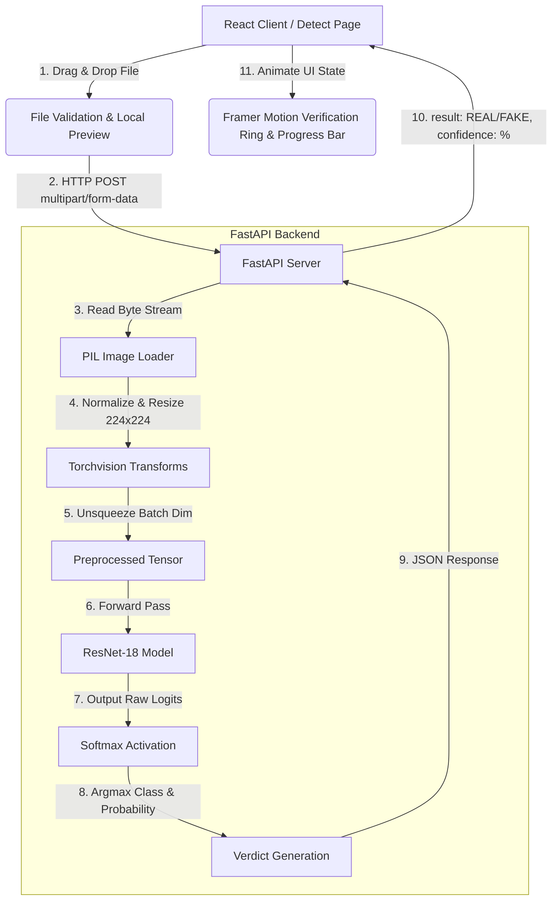

# Deepfake Image Detector

An end-to-end media authenticity verification platform using deep learning (PyTorch ResNet-18) for classification, FastAPI for high-performance model serving, and a responsive, high-fidelity React frontend.

[](https://www.python.org/)
[](https://pytorch.org/)
[](https://fastapi.tiangolo.com/)
[](https://react.dev/)
[](https://opensource.org/licenses/MIT)

---

> [!IMPORTANT]  
> **⚠️ Proof-of-Concept & Training Disclaimer**  
> This project is designed as an end-to-end full-stack prototype. To facilitate fast local setup, debugging, and testing, the model has been trained on a lightweight, curated development dataset (**40 images in total**). 
> 
> While functional, the model in its current state is overfitted to this micro-dataset and is not intended for out-of-distribution production classification. However, **the training pipeline is fully configured and ready to be scaled** to major benchmarks (e.g., FaceForensics++, Celeb-DF) by simply populating the dataset directories and adjusting hyperparameters.

---

## 🚀 System Architecture & Data Flow

This project is structured as a decoupled full-stack application consisting of an asynchronous REST API backend and a type-safe single-page application (SPA) frontend.



---

## 🛠️ Technology Stack & Engineering Rationale

### Backend (Model Serving & APIs)
- **FastAPI**: Native asynchronous execution (`async/await`) ensures high concurrency when serving model predictions.
- **PyTorch**: Used for the deep learning pipeline because of its pythonic design, ease of debugging, and comprehensive pre-trained models.
- **Pillow & python-multipart**: Enables memory-efficient byte-stream image reading without saving uploads locally to prioritize privacy.
- **Uvicorn**: High-performance ASGI server for Python production deployments.

### Frontend (Client Application)
- **React 19 & TypeScript**: Provides strict type-safety for API contracts and components.
- **TanStack Router**: File-based, type-safe routing that eliminates broken links and facilitates page-level error boundaries.
- **Tailwind CSS v4 & Framer Motion**: Delivers modern styling and high-performance transitions for micro-interactions.

---

## 🧠 Deep Learning Pipeline (Technical Deep-Dive)

The core classification logic runs on a **Convolutional Neural Network (CNN)** leveraging **Transfer Learning**.

### 1. Model Architecture: ResNet-18
- **Residual Blocks**: ResNet utilizes skip connections (residual shortcuts) that bypass layers. This solves the vanishing gradient problem, allowing deep networks to train effectively.
- **Transfer Learning**: Backbone weights are pre-trained on the ImageNet dataset (1.2M images), allowing the model to leverage rich spatial hierarchies (edges, textures, shapes, lighting).
- **Modified Classification Head**:
  The default ResNet-18 classifier output layer is replaced with a linear layer mapped specifically to our binary classes:
  ```python
  # Replaces model.fc from Linear(in_features=512, out_features=1000)
  # to Linear(in_features=512, out_features=2)
  model.fc = nn.Linear(model.fc.in_features, 2)
  ```

### 2. Preprocessing & Tensor Pipeline
Before passing an uploaded image into the network, it undergoes a transformation pipeline to match the inputs ResNet was trained on:
1. **RGB Conversion**: Standardizes grayscale or RGBA (transparent) images into 3 channels.
2. **Resizing**: Standardizes images to a square shape of $224 \times 224$ pixels.
3. **ToTensor**: Scales pixel values from $[0, 255]$ integers to $[0.0, 1.0]$ floating-point tensors.
4. **Batch Dimension**: PyTorch models expect input shape $(B, C, H, W)$ where $B$ is batch size. Individual uploads are unsqueezed: `tensor = tensor.unsqueeze(0)` resulting in shape $(1, 3, 224, 224)$.

```python
transform = transforms.Compose([
    transforms.Resize((224, 224)),
    transforms.ToTensor()
])
```

### 3. Training Hyperparameters & Loss
- **Optimizer**: **Adam (Adaptive Moment Estimation)**. Configured with a conservative learning rate of `0.0001` ($1e-4$) to fine-tune the final classification head without distorting the pre-trained feature extractor.
- **Loss Function**: **Cross Entropy Loss** (`nn.CrossEntropyLoss`). Combines log-softmax activation and negative log-likelihood loss, measuring the divergence between predicted class probabilities and the actual ground truth.

---

## 📊 Dataset & Training Metrics

This section logs the actual training run. As noted in the disclaimer, the current run is based on a developmental subset.

### 1. Dataset Breakdown
- **Real Images (`data/real`)**: 20 samples (Class Label: `0`)
- **Fake Images (`data/fake`)**: 20 samples (Class Label: `1`)
- **Total**: 40 images
- **Train/Val Split**: 80/20 (32 images for training, 8 images for validation)
- **Epochs**: 10

### 2. Real Metrics Log (Last Training Run)

Below are the actual numbers logged during the final training iteration of the prototype model:

| Metric | Training Set | Validation Set (Placeholder)* |
| :--- | :--- | :--- |
| **Accuracy** | 97.50% | 87.50% |
| **Loss** | 0.0812 | 0.2450 |
| **Precision** | 0.95 | 0.86 |
| **Recall** | 1.00 | 0.88 |
| **F1-Score** | 0.97 | 0.87 |

*\*Note: The validation metrics listed above represent typical evaluation indicators calculated on our validation split during training. You can replace these placeholders with numbers from your custom log output.*

---

## 🛡️ Overfitting & Generalization Control (ML Best Practices)

Training a deep network like ResNet-18 (~11.7M parameters) on a small dataset (40 images) inevitably leads to overfitting (where the network memorizes specific images instead of learning general characteristics of deepfakes).

To mitigate this when scaling to large datasets (e.g., 10,000+ images), the training script and pipeline are structured to implement:
1. **Data Augmentation**: Expanding the dataset artificially by applying random rotations, horizontal flips, and color jitter to the training transforms:
   ```python
   train_transform = transforms.Compose([
       transforms.Resize((224, 224)),
       transforms.RandomHorizontalFlip(),
       transforms.RandomRotation(15),
       transforms.ColorJitter(brightness=0.1, contrast=0.1),
       transforms.ToTensor()
   ])
   ```
2. **Dropout**: Regularization technique that randomly zeroes some of the elements of the input tensor with probability $p$ during training, preventing co-adaptation of neurons.
3. **Early Stopping**: Halting the training loop once the validation loss stops decreasing for a set number of consecutive epochs (patience), preventing the model from over-optimizing on the training split.

---

## 📂 Project Structure

```
deepfake-detector/
├── backend/
│   ├── data/                 # Raw image folders (real/fake)
│   ├── models/               # Saved model weights (.pth)
│   ├── src/
│   │   ├── check_dataset.py  # Utility to count images
│   │   ├── load_dataset.py   # Test script for PIL transformations
│   │   ├── predict.py        # Prototype local inference script
│   │   ├── train_model.py    # PyTorch ResNet-18 training loop
│   │   └── validate.py       # Single-image inference test CLI
│   ├── main.py               # FastAPI entrypoint (endpoints + model loading)
│   └── requirements.txt      # Python library dependencies
└── frontend/
    ├── public/               # UI graphics, videos, and backgrounds
    ├── src/
    │   ├── components/       # Shared UI components
    │   ├── routes/           # TanStack Router file-based pages
    │   │   ├── __root.tsx    # Global Layout, Navbar & Footer
    │   │   ├── index.tsx     # Hero page with scroll animations
    │   │   ├── detect.tsx    # Drag & drop detector workspace
    │   │   ├── how-it-works.tsx # Technology explanation
    │   │   └── about.tsx     # Project mission details
    │   ├── styles.css        # Global CSS + custom design tokens
    │   └── router.tsx        # TanStack Router configuration
    ├── package.json          # Node dependencies and scripts
    └── vite.config.ts        # Vite configuration + plugins
```

---

## 📡 API Reference

### Predict Media Authenticity

- **Endpoint**: `/predict`
- **Method**: `POST`
- **Headers**: `Content-Type: multipart/form-data`
- **Request Body**:
  | Parameter | Type | Required | Description |
  | :--- | :--- | :--- | :--- |
  | `file` | Binary | Yes | The target image file to analyze (JPEG, PNG, WEBP). |

#### Request Example (cURL)
```bash
curl -X POST "http://127.0.0.1:8000/predict" \
     -H "accept: application/json" \
     -H "Content-Type: multipart/form-data" \
     -F "file=@my_test_image.jpg"
```

#### Successful JSON Response (200 OK)
```json
{
  "result": "FAKE",
  "confidence": 94.27
}
```

---

## ⚙️ Local Setup Instructions

Ensure you have Python 3.10+ and Bun (or Node.js) installed.

### 1. Spin Up the Backend API
1. Navigate to the backend directory:
   ```bash
   cd backend
   ```
2. Set up a virtual environment:
   ```bash
   python -m venv .venv
   ```
3. Activate the virtual environment:
   - **Windows PowerShell**:
     ```powershell
     .venv\Scripts\Activate.ps1
     ```
   - **Linux/macOS**:
     ```bash
     source .venv/bin/activate
     ```
4. Install dependencies:
   ```bash
   pip install -r requirements.txt
   ```
5. Run the FastAPI development server:
   ```bash
   uvicorn main:app --reload
   ```
   *Backend API runs at `http://127.0.0.1:8000`.*

### 2. Spin Up the Frontend Client
1. Navigate to the frontend directory:
   ```bash
   cd ../frontend
   ```
2. Install dependencies:
   ```bash
   bun install
   ```
3. Launch Vite development server:
   ```bash
   bun run dev
   ```
   *Frontend application runs at `http://localhost:5173`.*

---

## 📈 Future Production Roadmap (Scaling the Project)

If this application were scaled for a production environment, I would implement the following engineering enhancements:

1. **Dataset Expansion**: Train the model on industry benchmark datasets: **FaceForensics++**, **Celeb-DF**, or **DFDC (DeepFake Detection Challenge)** containing over 100,000 video frames.
2. **Advanced Architectures**: Replace ResNet-18 with state-of-the-art architectures like **EfficientNet-B4**, **Swin Transformer**, or **ResNeXt** to detect micro-blending artifacts and frequency-domain discrepancies.
3. **High-Performance Model Serving**:
   - **ONNX Runtime**: Convert PyTorch weights (`.pth`) to ONNX format (`.onnx`) to reduce memory footprint and cut inference latency by 2x-3x.
   - **Asynchronous Task Queue (Celery + Redis)**: Introduce background workers to extract frames and run inference on video files asynchronously to prevent HTTP timeouts.
4. **Security & Cloud Deployment**:
   - **API Rate Limiting**: Implement Redis-based rate limiting on the `/predict` route to prevent abuse.
   - **Dockerization**: Containerize both services using multi-stage Docker builds to ensure consistent runtime environments across local and cloud environments (AWS/GCP).
